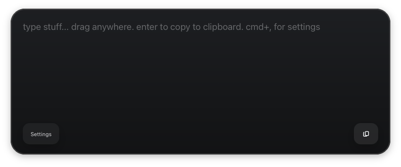

# box-with-words

A floating window you can type notes into and then copy to clipboard.

Built with Tauri v2 and includes:

- a centered typing box that grows as you write
- a user-configurable global hotkey
- a lightweight vanilla TypeScript frontend managed with `pnpm`

## Commands

- `pnpm install`
- `pnpm build`
- `pnpm tauri dev`

## Notes

- The default shortcut is `CommandOrControl+Shift+Space`.
- The chosen shortcut is stored in `localStorage`.
- Rust is required for `pnpm tauri dev` and native builds.
